# Instructions
**TODO:** Jessica Wilson 1983073

**TODO:** Add your screen captures to a new directory called [images](images).

**HINT:** Embed your screen captures as requested in the sections below. You can embed the image using the following syntax:

```

```

HW 8 Deliverables [50 pts]
DOCKER
- Your docker File. Please provide a link to this  File rather than a screen capture. https://github.com/jwils125/spring-petclinic/blob/master/Dockerfile
- Your running docker instance as shown by a ps command. 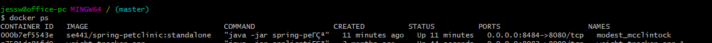
- Your browser accessing the main page of the website from your local container. 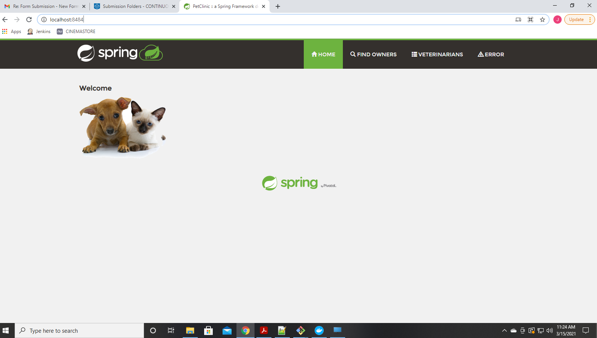
DOCKER COMPOSE - MYSQL ONLY
- The output from the docker-compose up command. 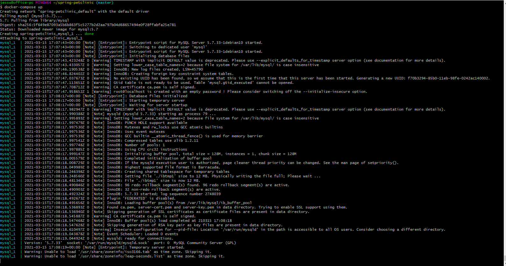
- Your browser accessing the "Veterinarians" page of the website from your local container when you run the application from the host system. 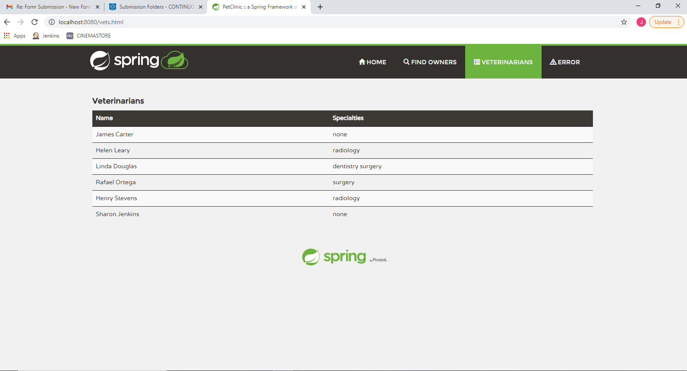
- A section of the stack trace generated when you attempt to run the application container that has been updated to use MySQL. 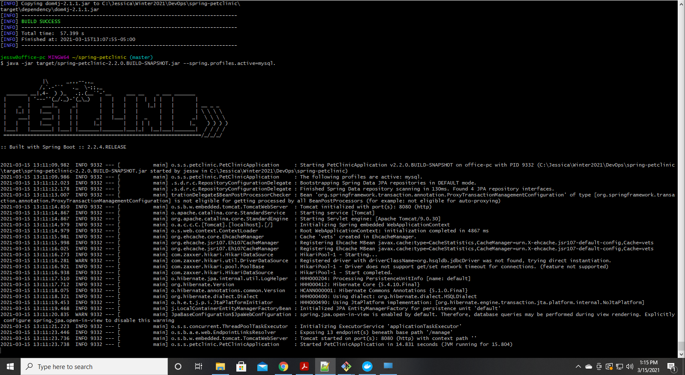
DOCKER COMPOSE - APP SERVER AND MYSQL
- Your updated docker-compose.yml  File containing the application server, built from your local Docker File, and the existing MySQL configuration. Please provide a link to this  File rather than a screen capture.
- Your updated application-mysql.properties  File containing the URL change for the database server. Please provide a link to this  File rather than a screen capture. https://github.com/jwils125/spring-petclinic/blob/master/docker-compose.yml
- The output from the docker-compose up command. 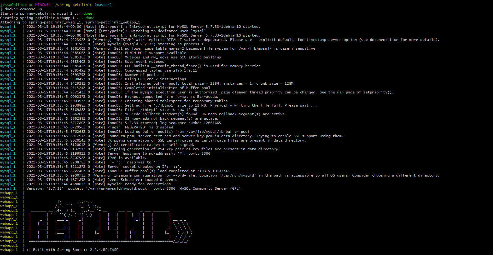
- Your browser accessing the "Veterinarians" page of the website from your local container. 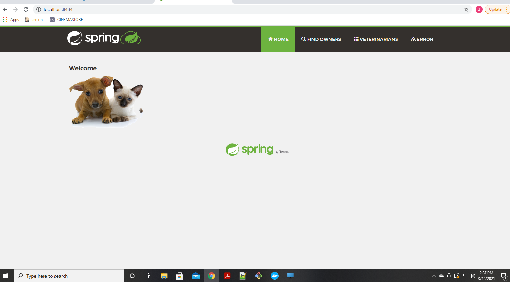


___________________
- Your Github account showing that is has been forked from the depaulcdm/springpetclinic repository. 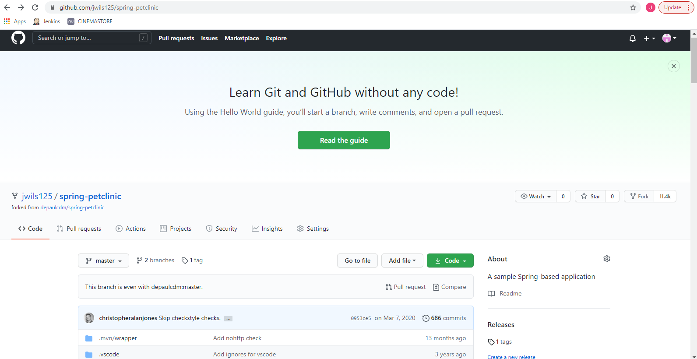
- Your Travis CI dashboard showing a successful first build. 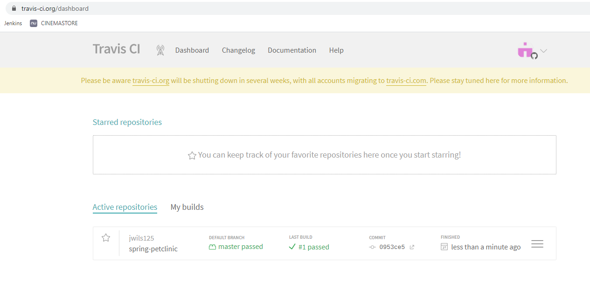
- The section of the POM file showing the coordinates after you’ve changed them. 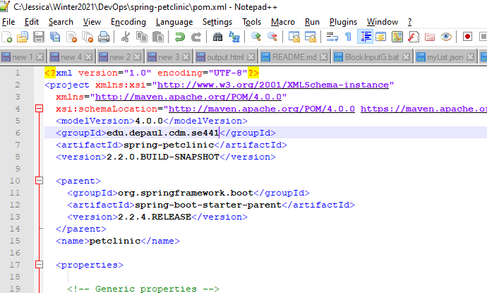
- Your Travis CI dashboard showing a successful build after your change of the group ID. 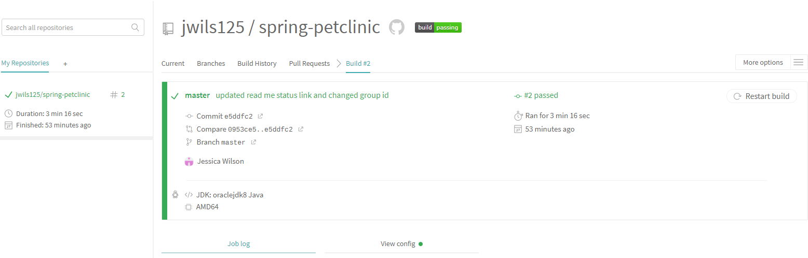
- The section of the POM file showing the coordinates after you’ve commented them out. 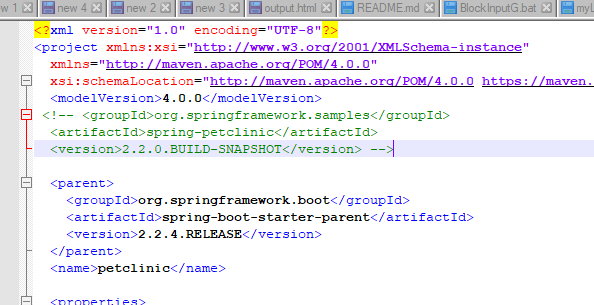
- Your Travis CI dashboard showing the unsuccessful build after the breaking change. 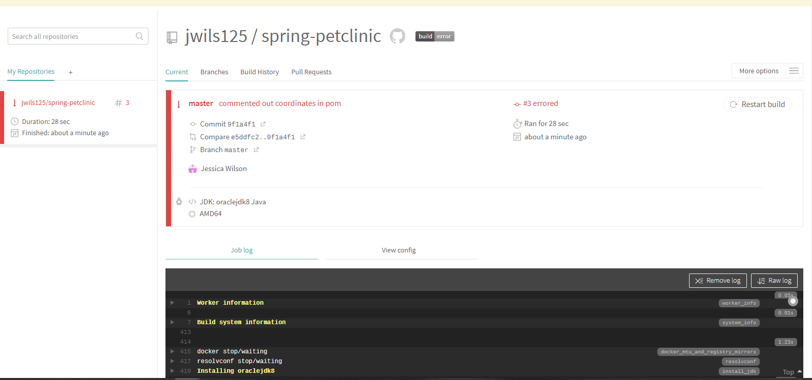
- Your Github repository with the readme.md file selected showing the build failed status after the Travis CI build fails. 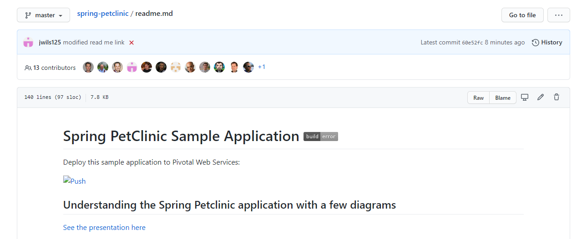
- The section of the POM file showing the coordinates after you’ve fixed them. 
- Your Travis CI dashboard showing the successful build after the breaking change has been fixed. 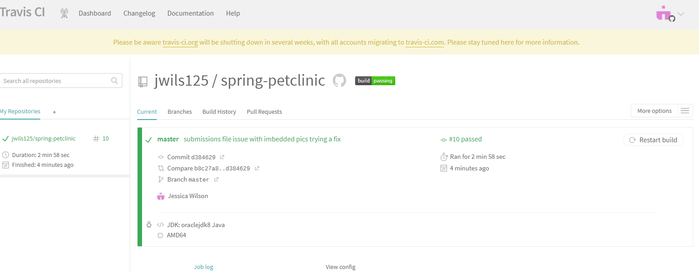
- Your Github repository with the readme.md file selected showing the build success status after the Travis CI build has recovered. 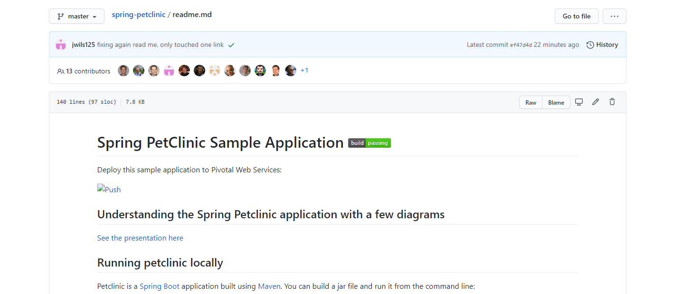